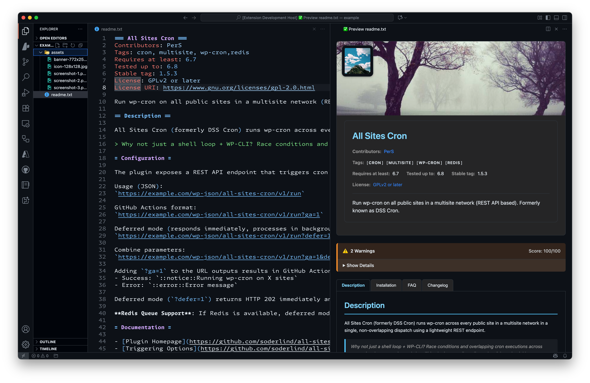

# WordPress Readme

A Visual Studio Code extension that provides syntax highlighting, IntelliSense, live preview and validation for WordPress plugin `readme.txt` files with pixel-perfect WordPress.org rendering and comprehensive compliance checking.

> Update 0.1.5: Improved heading normalization automatically converts hash-style (`#`, `##`, `###`) and malformed equals headings (`== Title =`, `= Title`) into proper WordPress readme format (`== Section ==` / `= Subsection =`) — including edge cases like `##Title`, `#  Title  `, and `# Title #`. Quick fixes now mirror this logic exactly.

## Features

✅ **Live Preview** - Real-time rendering matching WordPress.org appearance  
✅ **Comprehensive Validation** - WordPress.org compliance with precise error positioning  
✅ **Syntax Highlighting** - Enhanced editing experience for readme.txt files  
✅ **Smart Error Detection** - Inline highlighting with exact column positioning  
✅ **Context Menus** - Right-click support in explorer and editor tabs  
✅ **Scroll Synchronization** - Keep editor and preview in sync when scrolling  
✅ **Theme Support** - Automatic dark/light theme matching with VS Code  
✅ **Forced Background Modes** - Override preview to always light or dark  
✅ **Quality Scoring** - Get 0-100 quality score with improvement suggestions  
✅ **False Positive Prevention** - Accurate detection without hallucinated errors  
✅ **Tabbed wordpress.org Layout** - Authentic multi-tab presentation (Description, Installation, FAQ, Screenshots, Changelog)  
✅ **Accessible Screenshot Gallery** - Keyboard & screen reader friendly with thumbnails  
✅ **Section Heading IntelliSense** - Type `==` then space for valid section name completions  



## Quick Start

### Opening Preview

**Multiple Ways to Open:**
1. **Right-click** on `readme.txt` file → "Open Preview"
2. **Right-click** on editor tab → "Open Preview" 
3. **Editor toolbar** → Click preview button (📖)
4. **Command Palette** → "WordPress Readme: Open Preview"

### Validation

**Automatic validation:**
- Runs as you type with real-time feedback
- Precise line/column error positioning
- View all issues in Problems panel
- Status bar shows validation status

**Manual validation:**
- Right-click → "Validate Readme"
- Command Palette → "WordPress Readme: Validate Readme"
- Click status bar validation indicator

### Side-by-Side Preview

- **Right-click** → "Open Preview to the Side"
- **Editor toolbar** → "Open Preview to the Side" button
- **Command Palette** → "WordPress Readme: Open Preview to the Side"
- **Scroll Synchronization** - Automatically keeps editor and preview scrolled to the same position

## Validation Features

### Comprehensive WordPress.org Compliance

**Required Header Fields:**
- ✅ Plugin Name (`=== Plugin Name ===`)
- ✅ Contributors (WordPress.org usernames)
- ✅ Tags (1-5 recommended tags)
- ✅ Requires at least (WordPress version)
- ✅ Tested up to (WordPress version)  
- ✅ Stable tag (plugin version)
- ✅ License (GPL-compatible)
- ✅ Short description (≤150 characters)

**Advanced Content Validation:**
- 🎯 **Precise Error Positioning** - Exact line/column highlighting
- 🚫 **False Positive Prevention** - Smart detection avoids hallucinated errors
- 📏 **Length Validation** - Character limits for descriptions and notices
- 🔗 **URL Validation** - Donate links and license URIs
- 📝 **Section Structure** - Proper heading hierarchy and formatting
- 🏷️ **Version Format** - Semantic versioning compliance
- 📊 **File Size** - WordPress.org size recommendations

**Quality Scoring (0-100):**
- Real-time scoring as you edit
- Detailed suggestions for improvement  
- WordPress.org best practice compliance
- Bonus points for recommended sections

**Smart Detection:**
- ❌ **No false "pro" warnings** - Won't flag "provided", "process", "project"
- ❌ **No false email warnings** - Only flags actual email addresses
- ✅ **Context-aware validation** - Understands WordPress readme structure

## WordPress.org Markdown Support

**Full compatibility with WordPress.org rendering:**

- **Bold** and *italic* text formatting
- `Inline code` with proper HTML escaping (`<?php code(); ?>`)
- Fenced code blocks with syntax highlighting
- **Links** - Both inline `[text](url)` and reference-style `[text][ref]`
- **Link titles** - `[WordPress](https://wordpress.org "Title")` with hover text
- **Reference definitions** - `[ref]: https://example.com` (properly hidden)
- Ordered and unordered lists with nesting
- > Blockquotes for emphasis
- Video embeds (YouTube, Vimeo, VideoPress)
- FAQ sections with `= Question =` format
- Version headers in changelog `= 1.0 =`

**Accurate Rendering:**
- Matches WordPress.org plugin directory exactly
- Proper HTML escaping for security
- Responsive design for different screen sizes
- WordPress.org color scheme and typography
- **Auto Theme Matching** - Seamlessly adapts to VS Code's dark/light theme

## Configuration

All settings live under the `wordpress-readme.*` namespace.

| Setting | Type | Default | Description |
|---------|------|---------|-------------|
| `wordpress-readme.preview.autoOpen` | boolean | false | Auto-open preview when a `readme.txt` is opened |
| `wordpress-readme.preview.theme` | enum(classic|wordpress-org) | classic | Select layout style |
| `wordpress-readme.preview.backgroundMode` | enum(auto|light|dark) | auto | Force preview light/dark or follow editor theme |
| `wordpress-readme.preview.syncScrolling` | boolean | false | Synchronize scroll position between editor & preview |
| `wordpress-readme.validation.enabled` | boolean | true | Enable live validation |
| `wordpress-readme.validation.showWarnings` | boolean | true | Include warnings (not just errors) |
| `wordpress-readme.contextMenu.showInExplorer` | boolean | true | Show commands in Explorer context menu |
| `wordpress-readme.contextMenu.showInEditorTab` | boolean | true | Show commands in editor tab context menu |
| `wordpress-readme.contextMenu.showInEditor` | boolean | true | Show commands in editor content (text area) context menu |
| `wordpress-readme.contextMenu.showPreview` | boolean | true | Enable "Open Preview" entries |
| `wordpress-readme.contextMenu.showPreviewToSide` | boolean | true | Enable "Open Preview to the Side" entries |
| `wordpress-readme.contextMenu.showValidation` | boolean | true | Enable validation command entries |

Example customization snippet:

```jsonc
{
  "wordpress-readme.preview.theme": "wordpress-org",
  "wordpress-readme.preview.backgroundMode": "dark",
  "wordpress-readme.preview.syncScrolling": true,
  "wordpress-readme.validation.showWarnings": false
}
```

### Forced Background Mode
Use `backgroundMode` to view your readme in a fixed light or dark palette regardless of the editor theme. Great for checking color/contrast of inline badges or screenshots.

### Tag Appearance
Tags are rendered as simple uppercase bracketed items (e.g. `[SEO] [CACHE]`) for clarity and compactness—mirroring a neutral, style-light presentation for quick scanning.

## Available Commands

| Command | Access Method | Description |
|---------|---------------|-------------|
| `WordPress Readme: Open Preview` | Command Palette, Context Menu | Open preview in current editor group |
| `WordPress Readme: Open Preview to the Side` | Toolbar, Context Menu | Open side-by-side preview |
| `WordPress Readme: Validate Readme` | Context Menu, Command Palette | Run validation and show detailed results |
| `WordPress Readme: Auto-fix Markdown to WordPress style` | Command Palette | Apply safe formatting fixes (normalize headings, code blocks, spacing) |

## Context Menu Integration

**Right-click anywhere for quick access:**
- **File Explorer** - Right-click `readme.txt` file
- **Editor Tab** - Right-click on the tab title
- **Editor Content** - Right-click inside the editor

All context menus provide instant access to preview and validation commands.

## Scroll Synchronization

**Seamless Navigation:**
- **Automatic Syncing** - Editor and preview panels stay synchronized while scrolling
- **Bidirectional** - Scroll in either the editor or preview to sync both
- **Configurable** - Enable/disable via `wordpress-readme.preview.syncScrolling` setting
- **Smooth Performance** - Optimized for responsive scrolling without lag
- **Side-by-Side Mode** - Works perfectly when preview is opened to the side

**How it works:**
1. Open preview to the side for best experience
2. Scroll in the editor → preview follows automatically  
3. Scroll in the preview → editor follows automatically
4. Percentage-based positioning ensures accurate alignment
5. Temporary sync-lock prevents infinite scroll loops

## Theme Support

**Automatic Theme Detection:**
- **VS Code Integration** - Automatically matches your current VS Code theme
- **Dark Theme** - High contrast colors optimized for dark backgrounds
- **Light Theme** - Clean, readable colors for light backgrounds  
- **High Contrast** - Enhanced visibility for accessibility themes
- **Real-time Switching** - Instantly adapts when you change VS Code themes

**Theme Features:**
- **Smart Color Variables** - Uses VS Code's native color tokens
- **Proper Contrast** - Ensures readability in all theme variants
- **Consistent Branding** - Maintains WordPress.org visual identity
- **Border & Shadow Adaptation** - Adjusts visual elements for each theme
- **Code Block Styling** - Theme-aware syntax highlighting backgrounds

### Alternate Layout: wordpress-org Theme

You can switch to an alternative WordPress.org–style tabbed layout that more closely mirrors the official plugin directory presentation.

Setting:
```jsonc
"wordpress-readme.preview.theme": "wordpress-org" // default is "classic"
```

Features of the `wordpress-org` theme:
- Tabbed interface (Description, Installation, FAQ, Screenshots, Changelog, Reviews placeholder)
- Banner + Icon rendering (auto-detected)
- Responsive, accessible screenshot gallery (thumbnails + keyboard navigation + focus outlines)
- Keyboard navigation: Arrow keys / Home / End across tabs and thumbnails
- Deep linking using URL hash (e.g. `#faq` selects the FAQ tab)
- Graceful placeholders when a tab has no content

If a tab has no corresponding content it displays a subtle placeholder. Reviews are not locally generated (placeholder only).

### Plugin Asset Auto-Discovery

When using the `wordpress-org` theme the extension automatically searches for standard plugin assets next to your `readme.txt`:

Search order (first existing directory wins precedence if duplicates):
1. `.wordpress-org/`
2. `assets/`

Supported file patterns (case-insensitive):
- Banners: `banner-1544x500.(png|jpg)` (large), `banner-772x250.(png|jpg)` (small)
- Icons: `icon-256x256.*`, `icon-128x128.*`, `icon-64x64.*`, `icon-32x32.*` (`.png`, `.jpg`, `.jpeg`, `.svg`)
- Screenshots: `screenshot-1.(png|jpg|jpeg|gif)`, `screenshot-2.*`, etc.

The best available icon size is chosen in order: 256 → 128 → 64 → 32. Screenshots are displayed in ascending numerical order.

If no assets are found the layout gracefully omits the banner/icon/screenshot areas.

This mirrors the conventions used by WordPress.org so you can visually QA your assets before publishing. Gallery supports:

- Click thumbnail to swap main image
- Arrow key navigation through thumbnails
- Esc returns focus to the gallery container (when implemented in webview focus scope)
- Maintains aspect ratio and centers images on varied panel widths

> Tip: Keep your banner image optimized. WordPress.org expects specific dimensions and reasonable file sizes for performance.

## File Association

The extension automatically activates for:
- Files named `readme.txt`
- Files with `.txt` extension (when they contain WordPress readme content)

## Requirements

- Visual Studio Code 1.74.0 or higher
- No additional dependencies required

## Technical Features

### Architecture
- **TypeScript** - Type-safe development with full IntelliSense
- **Custom Parser** - Purpose-built WordPress readme.txt parser
- **Precise Validation** - Line/column accurate error positioning
- **WordPress.org Compliance** - Matches official validation standards
- **Performance Optimized** - Real-time validation without lag

### Key Bug Fixes
- ✅ **Section Header Regex** - Fixed false matches with plugin names
- ✅ **Inline Code Rendering** - Proper HTML escaping for `<?php ?>`
- ✅ **False Positive Prevention** - Smart promotional language detection  
- ✅ **Diagnostic Updates** - No duplicate errors, proper refresh
- ✅ **Column Positioning** - Exact error highlighting

## Validation Examples

**✅ Good:**
```
=== My Plugin ===
Contributors: myusername
Tags: tag1, tag2
Requires at least: 5.0
Tested up to: 6.3
```

**❌ Issues Detected:**
- Missing required fields (Contributors, Tags, etc.)
- Invalid version formats ("latest" instead of "6.3")
- Overly promotional language ("Best Ultimate Plugin")
- Actual email addresses in content
- Short descriptions over 150 characters

## Resources & References

- 📖 [WordPress Plugin Readme Standard](https://developer.wordpress.org/plugins/wordpress-org/how-your-readme-txt-works/)
- 🔍 [Official Readme Validator](https://wordpress.org/plugins/developers/readme-validator/)
- 🏪 [WordPress Plugin Directory](https://wordpress.org/plugins/)
- 📋 [Plugin Development Guidelines](https://developer.wordpress.org/plugins/)
- 🎨 [WordPress.org Design Patterns](https://wordpress.org/about/logos/)

## Troubleshooting

**Common Issues:**
- **No syntax highlighting?** → File must be named `readme.txt`
- **Validation not running?** → Check settings: `wordpress-readme.validation.enabled`
- **Context menu missing?** → Reload VS Code window after installation
- **Preview not updating?** → Ensure file is saved (auto-save recommended)

## Contributing

🐛 **Bug Reports:** Open issues with specific readme.txt examples  
💡 **Feature Requests:** Suggest improvements for WordPress.org compliance  
🔧 **Pull Requests:** Contributions welcome for parser and validation improvements  

## License

GPL-2.0-or-later © 2025 Per Soderlind

This program is free software: you can redistribute it and/or modify it under the terms of the GNU General Public License as published by the Free Software Foundation, either version 2 of the License, or (at your option) any later version.

This program is distributed in the hope that it will be useful, but WITHOUT ANY WARRANTY; without even the implied warranty of MERCHANTABILITY or FITNESS FOR A PARTICULAR PURPOSE. See the GNU General Public License for more details.

You should have received a copy of the GNU General Public License along with this program. If not, see https://www.gnu.org/licenses/.

---

Enjoying the extension? Star the repository or open an issue with feedback. Happy publishing!